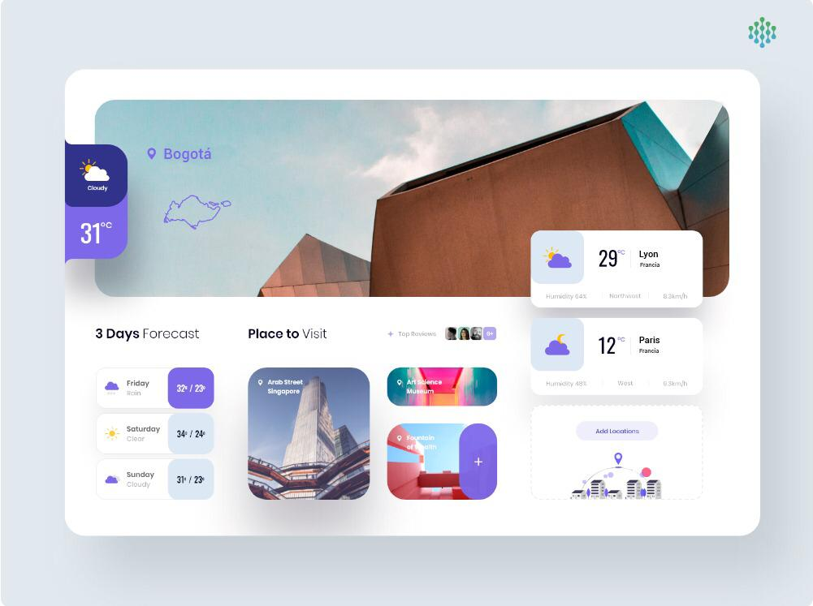

# App weather Bogotá y Francia
-------

## Objective:
-------
Make an App that allows knowing the climate of the cities of Bogotá, France and Lyon, with their respective icons according to the appi data from https://openweathermap.org/current.

the design should look like this image:

was done using Html5, Css3, flexbox, first mobile design, sass and JavaScript.

Design made for mobile, tablet and desktop.

## Contributions
-------
Feel free to fork the code and send pull requests if you want to contribute.